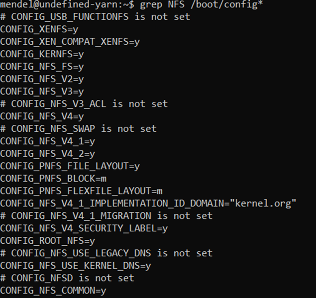

## NFS setup

>Hoe we NFS eerst wilde instellen. 
>Hoe we het uiteindelijk hebben ingesteld en alle problemen die we daarbij hadden.

Een Network File System is een manier om meerdere machines data gemakkelijk te delen met elkaar. Er is een centrale administratie voorzien. 

--> Afbeelding NFS

Er is een client-side file systeem en een server-side file systeem. De master node zal in ons geval de server zijn en de andere nodes zijn de clients. Een client kan dan een system call doen om bijvoorbeeld files op te roepen van de server. 

Hoe zet ik een NFS server op:
 - Eerst moeten we de NFS server package installeren met volgend commando: 
 ``` bash 
 sudo apt install nfs-kernel-server
 ```
 - Daarna zorgen we ervoor dat de NFS service runt en automatisch opstart bij het starten van de node.
 ``` bash 
 sudo systemctl enable --now nfs-server
 ```
 - Hebben we nog geen directory aangemaakt waaruit we de files willen delen dan maken we die even aan
 ``` bash 
 sudo mkdir -p /media/nfs
 ```
- We passen de /etc/exports file aan. Hierin kunenn we beslissen welke directories we willen delen en we hier toegang tot heeft. Indien gewenst kan men ook een limiet instellen op het aantal keer men kan delen. 
``` bash 
 sudo nano /etc/exports
 ```
- In deze file krijgt elke node zijn eigen lijn. Deze begint met de locatie van de node. Dit kan aan de hand van het IP adres. Hierachter plaatst men de regels die men aan de node wilt toevoegen. Een voorbeeld van hoe dit er dan kan uitzien:
``` bash 
 /media/nfs             192.168.1.1/24(rw,sync,no_subtree_check)
 ```
- Enkele regels die men kan instellen
--> Afbeelding

- We slagen de file op en executen dit om er voor te zorgen dat de aanpassingen zijn opgeslagen. 
--> Afbeelding 

Hoe connecteer ik met de NFS server vanaf mijn client
- De NFS packages worden geïnstalleerd
``` bash 
 sudo apt install nfs-common
 ```
- De NFS file wordt gemount
``` bash 
 sudo mount -t nfs4 192.168.1.110:/media/nfs /media/share
 ```

Errors 

--> Screenshots


De [NFS FAQ](https://nfs.sourceforge.net/nfs-howto/ar01s07.html#nfsd_wont_start) [1.] voorspelde al ongeveer wat het probleem was. `nfsd` is niet aanwezig in de Mendel Linux kernel.

Het `motprobe` commando mocht ook niet baten want de `nfsd` module is niet aanwezig in het Mendel systeem. Dit wil zeggen dat we de `nfsd` module zelf zouden moeten compileren en toevoegen aan de kernel.



> 1. https://nfs.sourceforge.net/nfs-howto/ar01s07.html#nfsd_wont_start
> 2. https://nfs-ganesha.github.io/
> 3. https://objectivefs.com/howto/how-to-set-up-nfs-ganesha
> 4. https://objectivefs.com/howto/how-to-set-up-nfs-ganesha
> 5. https://github.com/nfs-ganesha/nfs-ganesha/blob/next/src/config_samples/export.txt
> 6. https://cloudnull.io/2017/05/nfs-mount-via-systemd/

### NFS Ganesha


NFS-Ganesha is een implementatie van een NFS-server voor de user space in plaats van de kernel space. Dit maakt de implementatie flexibeler. De NFS server was al snel draaiende! Een nadeel van deze implementatie is dat het iets trager is. Dit kunnen we proberen te optimaliseren door bijvoorbeeld locking uit te schakelen. 

Blij locking wordt een bestand dat door een gebruiker over het netwerk gedeeld is vastgezet wanneer er een gebruiker dit aan het bewerken is. Dit principe zorgt ervoor dat erg geen data verloren gaat wanneer twee mensen hetzelfde bestand overschrijven, maar maakt de server ook iets trager.  


Standaard instelling:

```apacheconf
###################################################
#
# EXPORT
#
# To function, all that is required is an EXPORT
#
# Define the absolute minimal export
#
###################################################

EXPORT
{
        # Export Id (mandatory, each EXPORT must have a unique Export_Id)
        Export_Id = 77;

        # Exported path (mandatory)
        Path = /nonexistant;

        # Pseudo Path (required for NFS v4)
        Pseudo = /nonexistant;

        # Required for access (default is None)
        # Could use CLIENT blocks instead
        Access_Type = RW;

        # Exporting FSAL
        FSAL {
                Name = VFS;
        }
}
```

Na het commando `sudo systemctl start nfs-ganesha` was de NFS-server gestart! We konden ook de positieve status zien.

<pre><font color="#8AE234"><b>●</b></font> nfs-ganesha.service - NFS-Ganesha file server
   Loaded: loaded (/lib/systemd/system/nfs-ganesha.service; enabled; vendor preset: enabled)
   Active: <font color="#8AE234"><b>active (running)</b></font> since Mon 2022-11-14 11:58:55 UTC; 13s ago
     Docs: http://github.com/nfs-ganesha/nfs-ganesha/wiki
  Process: 5457 ExecStart=/bin/bash -c ${NUMACTL} ${NUMAOPTS} /usr/bin/ganesha.nfsd ${OPTIONS} ${EPOCH} (code=exited, status=0/SUCCESS)
  Process: 5462 ExecStartPost=/bin/bash -c prlimit --pid $MAINPID --nofile=$NOFILE:$NOFILE (code=exited, status=0/SUCCESS)
  Process: 5463 ExecStartPost=/bin/bash -c /bin/sleep 2 &amp;&amp; /usr/bin/dbus-send --system   --dest=org.ganesha.nfsd --type=method_call /or
 Main PID: 5458 (ganesha.nfsd)
    Tasks: 277 (limit: 797)
   Memory: 59.0M
   CGroup: /system.slice/nfs-ganesha.service
           └─5458 /usr/bin/ganesha.nfsd -L /var/log/ganesha/ganesha.log -f /etc/ganesha/ganesha.conf -N NIV_EVENT
Nov 14 11:58:53 purple-mole systemd[1]: Starting NFS-Ganesha file server...
Nov 14 11:58:55 purple-mole systemd[1]: Started NFS-Ganesha file server.
root@purple-mole:~# showmount -e localhost
Export list for localhost:
/home/mendel/share (everyone)
</pre>


Momenteel ziet onze ganesha.conf er zo uit:

```apacheconf
###################################################
#
# EXPORT
#
# To function, all that is required is an EXPORT
#
# Define the absolute minimal export
#
###################################################

EXPORT
{
	# Export Id (mandatory, each EXPORT must have a unique Export_Id)
	Export_Id = 77;

	# Exported path (mandatory)
	Path = /home/mendel/share;

	# Pseudo Path (required for NFS v4)
	Pseudo = /home/mendel/share;

	# Required for access (default is None)
	# Could use CLIENT blocks instead
	Access_Type = RW;

	# Exporting FSAL
	FSAL {
		Name = VFS;
	}
	CLIENT
	{
        Clients = 192.168.88.12, 192.168.88.13, 192.168.88.14, 192.168.88.15;
	}
}
```


### Automount master NFS share

Tutorial is bron nr 4.

`nfs-common` zeker installeren.

`sudo nano /etc/systemd/system/mnt-share.mount`

```apacheconf
[Unit]
Description=NFS share van de Master node
After=network.target

[Mount]
What=192.168.88.11:/home/mendel/share
Where=/mnt/share
Type=nfs
Options=_netdev,auto

[Install]
WantedBy=multi-user.target
```

`sudo systemctl daemon-reload`

`sudo systemctl start mnt-share.mount`

`sudo systemctl enable mnt-share.mount`

`sudo systemctl status mnt-share.mount`

<pre><font color="#8AE234"><b>mendel@purple-kid</b></font>:<font color="#729FCF"><b>~</b></font>$ sudo systemctl status mnt-share.mount
<font color="#8AE234"><b>●</b></font> mnt-share.mount - NFS share van de Master node
   Loaded: loaded (/etc/systemd/system/mnt-share.mount; enabled; vendor preset: enabled)
   Active: <font color="#8AE234"><b>active (mounted)</b></font> since Mon 2022-11-14 15:49:24 UTC; 1min 58s ago
    Where: /mnt/share
     What: 192.168.88.11:/home/mendel/share
    Tasks: 0 (limit: 797)
   Memory: 416.0K
   CGroup: /system.slice/mnt-share.mount
Nov 14 15:49:24 purple-kid systemd[1]: Mounting NFS share van de Master node...
Nov 14 15:49:24 purple-kid systemd[1]: Mounted NFS share van de Master node.
</pre>
